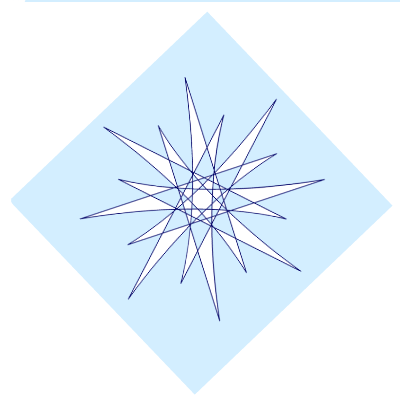
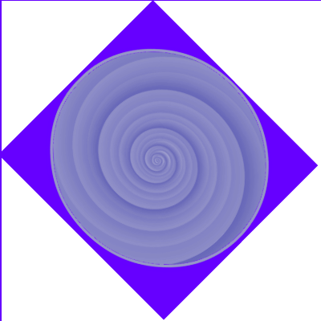
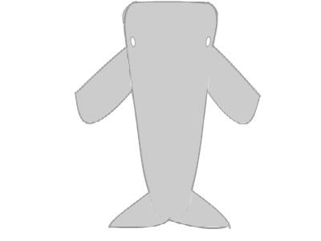

![Two-Dimensional Tower Defense (tdtd)][game logo]

This game was originally created for the University of Waterloo Games Institute Jam (Spring 2015)

![Fellowship of the Bus][logo]

## Installation
There are two recommended options for running this game.

1. Download one of the pre-built executable JAR files under [releases]. Run it by either double-clicking the JAR file or entering the command `java -jar <jar-name>` on the command line.
2. Build from source. The easiest way to do so is to use [sbt]:
    1. Install sbt.
    2. Run sbt from the command line in the project root directory.
    3. At the prompt, type `run`.

## Controls
This game is primarily controlled by clicking on buttons in the interface. There are several hotkeys that make it easier to control the game.

* Harpoon Tower: H
* Cannon Tower: C
* Torpedo Tower: T
* Oil Drill: O
* Ice Tower: I
* Depth Charge Tower: D
* Whirlpool Tower: W
* Missile Tower: M
* Net Tower: N
* Steam Tower: S
* Sell currently selected tower: Shift + S
* Upgrade the currently selected tower: U
* Clears the current selection: Esc
* Toggle fast-forward mode: F
* Start next wave: Space

## How to Play
The object of the game is to defeat as many enemies as possible before losing all of your lives. Your current number of lives is displayed in the top left of the screen. You lose one life each time an enemy reaches the destination at the bottom of the playing field.

[![video image]][video]

TDTD is a "mazing" tower defense game. By strategically placing your towers, you influence the route that enemies can take to reach their goal. Build your own custom maze to corral enemies away from the exit, or to utilize advanced tactics such as enemy juggling.

The element that separates TDTD from other tower defense games is its double-layer playing field, wherein you must mount a defense above and below the water. On the left side of the screen is the top layer, where enemies like alligators, dolphins, and the resilient hydra dwell. On the right side is the bottom layer, where you must defend against enemies such as squid, sharks, and the immortal jellyfish.

![TDTD][setup]

Each time you defeat an enemy, you receive a set amount of money. You can use money to buy new towers, upgrade existing towers, and purchase AI customization options. If you find that a tower is not performing as well as you had hoped, you can sell it for 50% of its current value.

Click on any tower on the playing field to view its statistics, such as:

* Its current dollar value
* The cost to upgrade a level
* The amount of damage it deals per hit
* Firing rate
* Attack range
* Currently selected AI
* Number of kills
* Total amount of damage dealt so far
* A short description of the tower

Each kind of tower has unique strengths and weaknesses. Due to the dual-layered nature of the game, some towers interact with just one layer, while others can take effect in both.

Towers that appear on the left side of the market UI can only be placed on the top layer, while towers on the right must be placed on the bottom layer. The two special towers in the middle interact with both layers. When placing a tower on the field, pay close attention to its attack radius.

The next wave of enemies is shown at the top of the screen. Use this information to plan your tower layout appropriately.

Challenge yourself to survive as many waves as you can!

### Tower Types

The base stats of the various towers are listed below.

1. 
 Harpoon Tower
    * Damage: 5
    * Firing Rate: 1 second
    * Range: 2
    * Projectile Speed: 24
    * Cost: $10
    * Cheap, weak tower. Useful for mazing. Can be placed on the top or bottom layer.
2. 
 Cannon Tower
    * Damage: 15
    * Firing Rate: 2 seconds
    * Range: 2.5
    * AOE Radius: 1
    * Projectile Speed: 12
    * Cost: $30
    * Strong, Area of Effect damaging tower. Can only be placed on the top layer.
3. 
 Torpedo Tower
    * Damage: 20
    * Firing Rate: 1.5 seconds
    * Range: 3.5
    * Projectile Speed: 18
    * Cost: $20
    * Medium cost, medium damage tower. Can only be placed on the bottom layer. Can fire at enemies on either layer.
4. 
 Oil Drill
    * Cost: $200
    * Provides a bonus $30 at the end of each wave.
    * Simultaneously takes up space on both layers.
5. 
 Ice Tower
    * Range: 2
    * Cost: $20
    * Slows enemies to 1/4 speed when in range
    * Simultaneously takes up space on both layers. Targets enemies only on the bottom layer.
6. 
 Depth Charge Tower
    * Damage: 15
    * Firing Rate: 0.7 seconds
    * Range: 1.5
    * AOE Radius: 1.5
    * Projectile Speed: 12
    * Cost: $20
    * Can only be placed on the top layer. Can only fire at enemies on the bottom layer.
7. 
 Whirlpool Tower
    * Range: 1
    * Cost: $20
    * Slows enemies to 2/5 speed. Can only be placed on the bottom layer. Affects enemies within range on both layers.
8. 
 Missile Tower
    * Damage: 25
    * Firing Rate: 1.5 seconds
    * Range: 3
    * Projectile Speed: 18
    * Cost: $50
    * Can only be placed on the top layer. Shoots 3 fast projectiles at enemies within range on the top layer.
9. 
 Net Tower
    * Firing Rate: 1.5 seconds
    * Range: 2
    * AOE Radius: 0.1
    * Projectile Speed: 24
    * Cost: $25
    * Can only be placed on the top layer. Completely ensnares enemies caught in the net, preventing movement.
10. 
 Steam Tower
    * Damage: 10
    * Firing Rate: 1 second
    * Range: 3
    * Projectile Speed: 24
    * Cost: $30
    * Can only be placed on the bottom layer. Shoots in one of the four cardinal directions, damaging all enemies within range.

#### Tower AI

There are three types of tower AI available. AI selection options become available by paying $20 on a per-tower basis. Once the AI option is purchased for a tower, it can be changed on the fly without additional charges. The different types of AI are:

1. Random: The tower randomly selects an enemy within its range as its target
2. Closest to Tower: The tower selects the enemy that is closest to itself as its target
3. Closest to Goal: The tower selects the enemy that is closest to the goal as its target

### Enemy Types

Enemies are spawned in waves from the top of the screen. The first few waves contain enemies on only one layer, but as the game progresses, each wave of enemies increases in difficulty over the previous wave by including more enemies, stronger enemies, and eventually enemies on both layers at the same time. Each kind of enemy appears exclusively either on the top layer or the bottom layer. The various types of enemies in the game are:

#### Above Water

1. 
 Alligator
    * Health: 22
    * Armor:  0
    * Speed: 2.4
    * Bounty: $3
    * Standard, weak enemy
1. 
 Dolphin
    * Health: 18
    * Armor: 0
    * Speed: 3
    * Bounty: $4
    * Fast and frail. It accelerates on straight paths.
1. 
 Turtle
    * Health: 25
    * Armor: 4
    * Speed: 2.1
    * Bounty: $7
    * Armored, but has slower movement speed.
1. 
 Hippo
    * Health: 30
    * Armor: 0
    * Speed: 1.8
    * Bounty: $1
    * High health, but has slower movement speed.
1. 
 Hydra
    * Health: 300
    * Armor: 0
    * Speed: 1.8
    * Bounty: $100
    * Boss enemy. Regenerates health over time.

#### Underwater

1. 
 Fish
    * Health: 10
    * Armor: 0
    * Speed: 2.4
    * Bounty: $1
    * Standard, weak enemy. Comes in swarms.
1. 
 Shark
    * Health: 20
    * Armor: 0
    * Speed: 2.4
    * Bounty: $3
    * Standard, weak enemy.
1. 
 Crab
    * Health: 25
    * Armor: 3
    * Speed: 2.1
    * Bounty: $6
    * Armored, but has slower movement speed.
1. 
 Jellyfish
    * Health: 50
    * Armor: 0
    * Speed: 2.4
    * Bounty: $5
    * Duplicates itself every so often.
1. 
 Squid
    * Health: 15
    * Armor: 0
    * Speed: 3
    * Bounty: $2
    * High movement speed.
1. 
 Whale
    * Health: 100
    * Armor: 0
    * Speed: 1.8
    * Bounty: $10
    * High health, but moves slower.
1. 
 Megalodon
    * Health: 700
    * Armor: 0
    * Speed: 2.1
    * Bounty: $100
    * Boss enemy, has very high health

## Credits

### Programming
* [Rob Schluntz]
* [Kevin Wu]
* [Travis Bartlett]
* [Abraham Dubrisingh]

### Art
* Abraham Dubrisingh, using [SumoPaint](https://www.sumopaint.com/)

### Special Thanks
* This game was heavily inspired by Bloons Tower Defense, Gem Tower Defense, and various other tower defense games
* [Mf Sippin On Sunshine](http://www.fontspace.com/mistis-fonts/mf-sippin-on-sunshine) font created by Misti's Fonts
* [Ringbearer](http://www.fontspace.com/pete-klassen/ringbearer) font created by Pete Klassen

[Rob Schluntz]: https://github.com/saitou1024
[Abraham Dubrisingh]: https://github.com/Greatrabe
[Kevin Wu]: https://github.com/smashkevin
[Erin Blackmere]: https://github.com/erin2kb
[Travis Bartlett]: https://github.com/kjifs

[setup]: images/setup.png
[video]: https://www.youtube.com/watch?v=WSZujCk0FkE
[video image]: images/video.png
[screenshot]: images/screenshot.png

[game logo]: src/main/resources/img/GameLogo.png
[logo]: src/main/resources/img/FotB-Logo.png
[releases]: ../../releases
[sbt]: http://www.scala-sbt.org/
